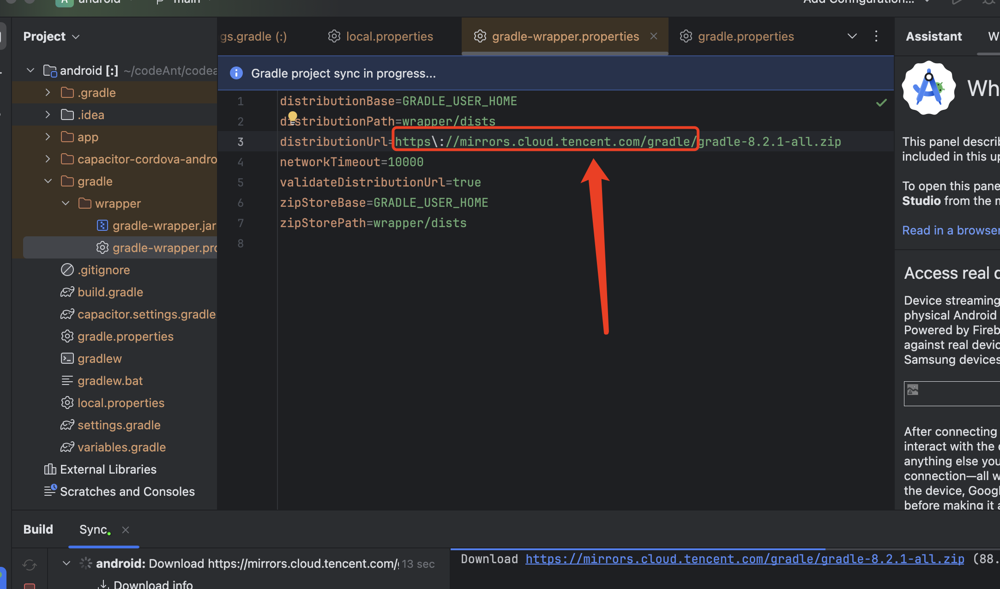
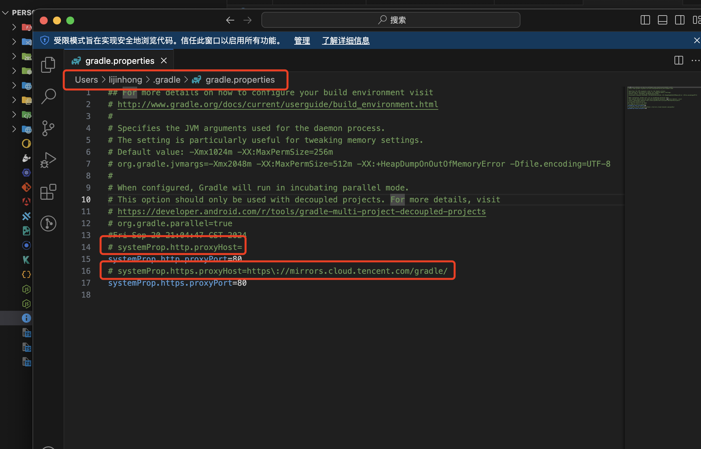
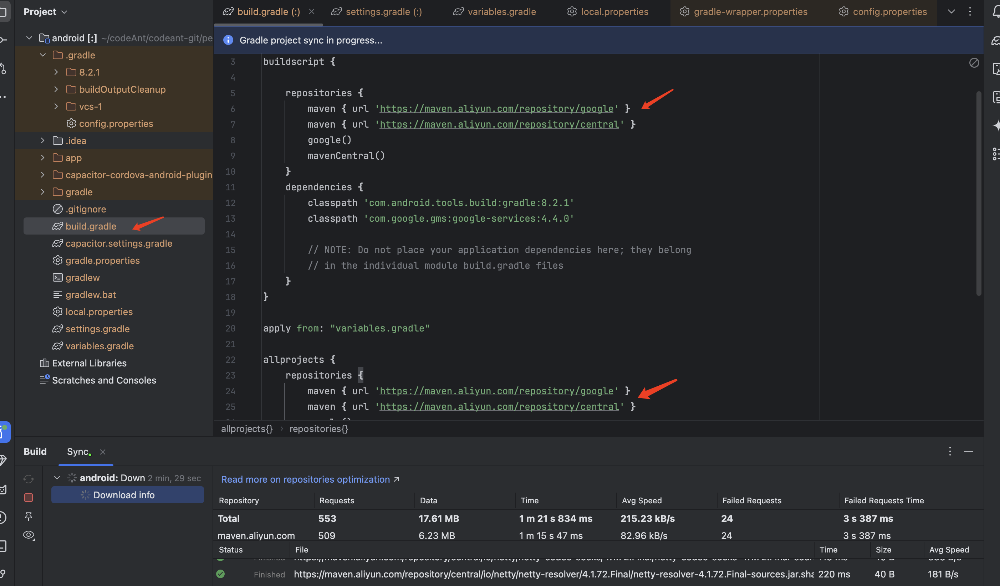
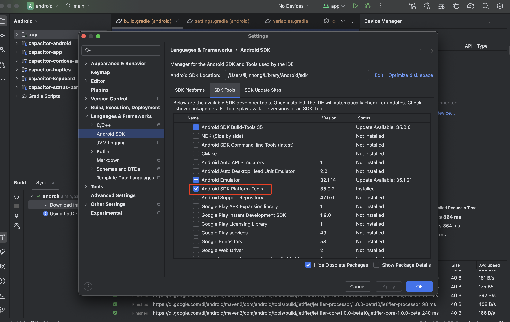
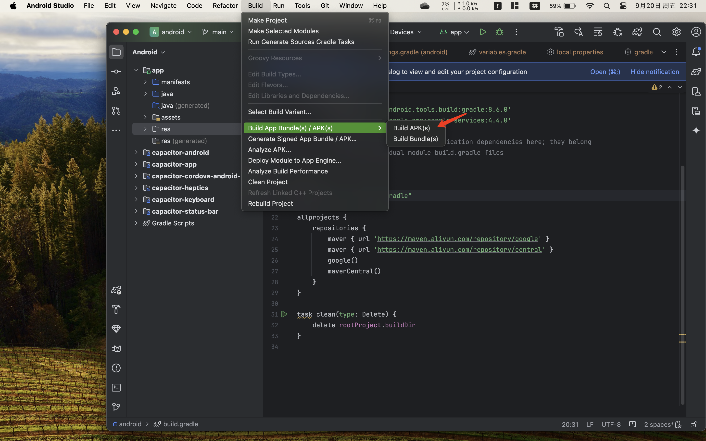

# 运行流程
首先，安装@capacitor/android。

npm install @capacitor/android

接下来，添加Android的平台。
根目录执行下列命令

npx cap add android

android studio打开android目录
修改为https\://mirrors.cloud.tencent.com/gradle


注释掉


增加代理，提升下载速度
```

        maven { url 'https://maven.aliyun.com/repository/google' }
        maven { url 'https://maven.aliyun.com/repository/central' }
```



确保安装了这个，否则无法启用wifi调试


打包


代码更新后，同步刷新安卓代码

ng build && npx cap copy


# i18n
参考：https://cloud.tencent.com/developer/article/1533019
```
$ npm install @ngx-translate/core @ngx-translate/http-loader --save
$ npm install @biesbjerg/ngx-translate-extract --save-dev

```

# sqlite

https://github.com/capacitor-community/sqlite?tab=readme-ov-file